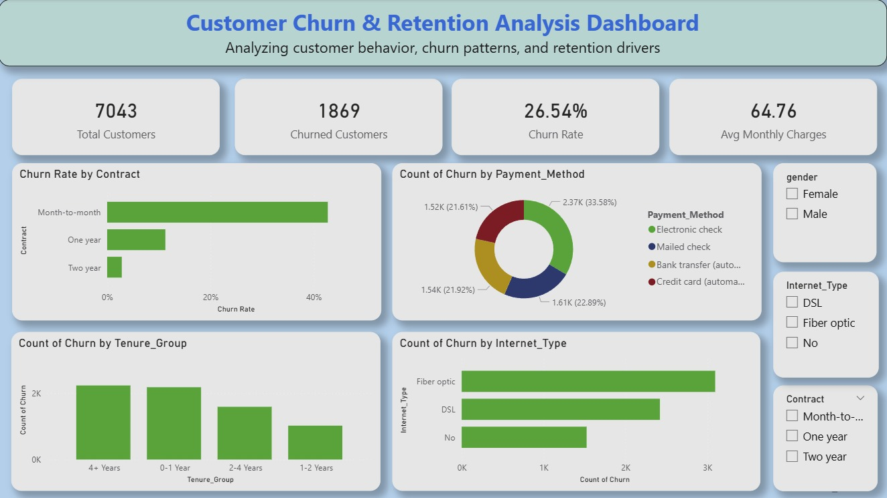

# Customer Churn Dashboard

## 📊 Project Overview
This project is a Power BI dashboard analyzing customer churn behavior and identifying factors that lead to customer loss.

## 🔧 Tools Used
- Power BI
- Excel

## 📈 Key Insights
- Identified churn rate across different customer segments
- Analyzed factors influencing customer retention
- Compared active vs churned customers

## 📷 Dashboard Preview

## 📌 Conclusion
This dashboard helps businesses understand customer behavior and improve retention strategies.
